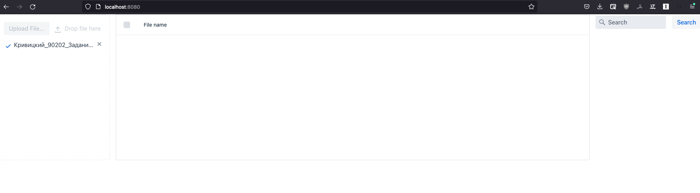
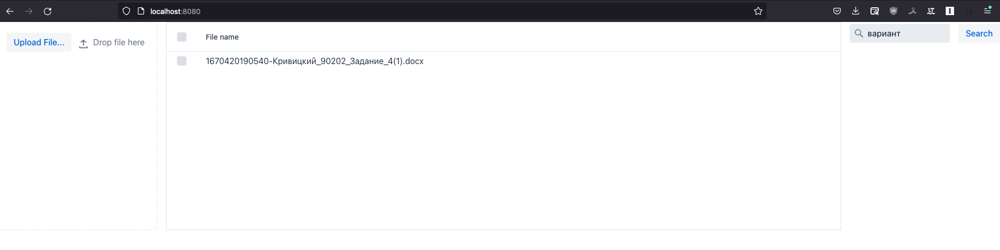

# Docs-storage
Service that allows to store DOC, DOCS, PDF files and retrieve it by queries

## Examples



## Build and run
1. Build docker image
```bash 
docker build -t docs-storage:latest .
```
2. Run docker image
```bash 
docker run --name docs-storage -p 8080:8080 docs-storage:latest
```
